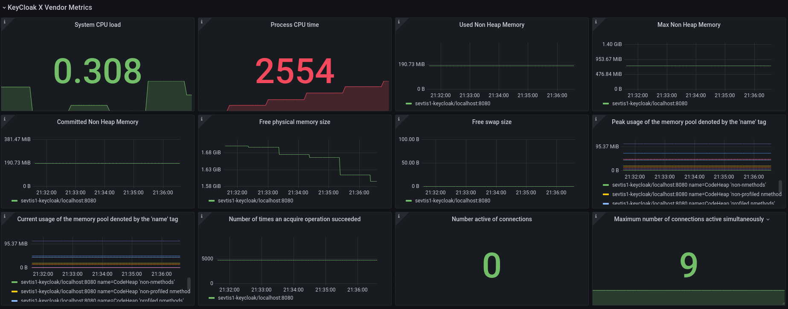

# This is a Fork
Tested with keycloak.X (Quarkus) nightly (>17.0.1) on 2022/03/24

https://quay.io/repository/keycloak/keycloak/manifest/sha256:b3afdc791b3d0d23b34353d44bd09cdceb933deb921dec7da30420334d48c616

I'm deploying it on kubernetes, with a customized [helm chart](https://github.com/W4lspirit/helm-charts/tree/poc/keycloakx)

```dockerfile
FROM quay.io/keycloak/keycloak:nightly as builder

ENV KC_HEALTH_ENABLED=true
ENV KC_METRICS_ENABLED=true
ENV KC_DB=postgres
RUN /opt/keycloak/bin/kc.sh build --transaction-xa-enabled=false --cache-stack=kubernetes --health-enabled=true

FROM quay.io/keycloak/keycloak:nightly
COPY --from=builder /opt/keycloak/lib/quarkus/ /opt/keycloak/lib/quarkus/
WORKDIR /opt/keycloak

ENTRYPOINT ["/opt/keycloak/bin/kc.sh", "start"]
```

I'm using Azure Database for PostgreSQL, it does not support distributed transaction, so I have disabled it `--transaction-xa-enabled=false` (It's only possible at build time https://github.com/keycloak/keycloak/pull/10378).

# Datasource selection
If you have multiple datasource(1 prom/env) you can configure it in the regex field.

For this exemple with suppose the naming scheme is
prometheus-k8s-xxxx-team-env-region
```json
      {
        "current": {
          "selected": false,
          "text": "Prometheus",
          "value": "Prometheus"
        },
        "hide": 1,
        "includeAll": false,
        "multi": false,
        "name": "PROMETHEUS_DS",
        "options": [],
        "query": "prometheus",
        "refresh": 1,
        "regex": "/prometheus-k8s-.*-team-./",
        "skipUrlSync": false,
        "type": "datasource"
      }
```

```
Orignal readme below
         |
         |
         v
```
# keycloak.X-grafana-dashboard

## Description
Includes a [KeyCloak.X-Preview](https://www.keycloak.org/2020/12/first-keycloak-x-release.adoc) Grafana dashboard to display the Quarkus MicroProfile metrics. The version 2 of the dashboard includes a switch of the Grafana graph to the timeseries type.

## Functionality

Visualize the corresponding KeyCloak.X-Preview Quarkus MicroProfile metrics from the selected Grafana data source.

## Grafana Dashboard
[KeyCloak X Grafana Dashboard](https://grafana.com/grafana/dashboards/14390)

## Images

### Base metrics


### Vendor metrics



## Contribution

If you would like to contribute, have an improvement request, or want to make a change inside the code, please open a pull request.

## Support

If you need support, or you encounter a bug, please don't hesitate to open an issue.

## Donations

If you would like to support my work, I ask you to take an unusual action inside the open source community. Donate the money to a non-profit organization like Doctors Without Borders or the Children's Cancer Aid. I will continue to build tools because I like it and it is my passion to develop and share applications.

## License

This product is available under the Apache 2.0 [license](LICENSE).
